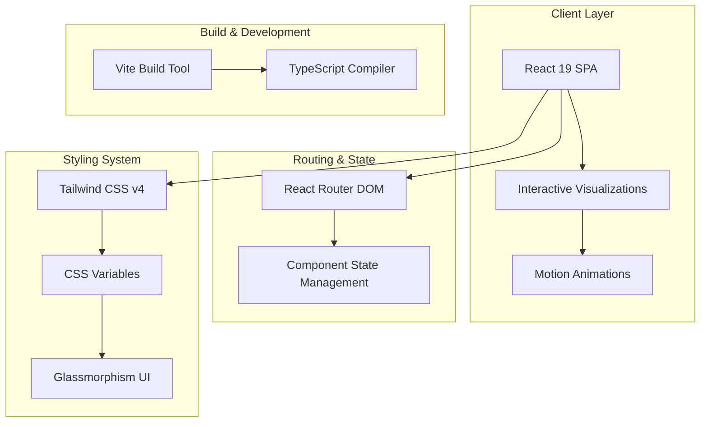

# 🎨🧩 Rosetta Code Hub

### Interactive Programming Visualizations - Where Code Meets Art

**Rosetta Code Hub** is an ambitious portfolio project transforming classic programming problems from [Rosetta Code](https://rosettacode.org/) into stunning, interactive visualizations. Learn algorithms, data structures, and computational thinking through immersive visual demonstrations.

> 🚧 **Project Status**: Actively in development | **Progress**: 25+ visualizations completed | **Goal**: 1000+ problems from Rosetta Code

[Documentation](#dokumentasi) • [Roadmap](#roadmap) • [Featured Visualizations](#-featured-visualizations)

---

## ✨ Fitur Utama

### 🎯 Interactive Visual Learning
- **25+ Programming Problems** visualized (and counting!)
- Each visualization is unique and hand-crafted with care
- Real-time animations showcasing algorithm execution step-by-step
- Beautiful UI with smooth transitions and micro-interactions
- Touch-friendly controls for mobile learning

### 🎨 Premium Design System
- **Dark Mode** with vibrant neon accents and glassmorphism
- Carefully curated color palette using advanced CSS techniques
- Responsive layouts (mobile-first, 320px - 2560px+)
- Custom animations with Motion (Framer Motion successor)

### 🧩 Diverse Problem Categories
- **Mathematical Puzzles**: 9 Billion Names of God, Achilles Numbers, Almkvist-Giullera Formula
- **Game Simulations**: 15 Puzzle, 21 Game, 24 Game, 100 Prisoners Problem
- **Cellular Automata**: Abelian Sandpile Model with neon toppling effects
- **String Processing**: Anagrams, Anadromes, Abbreviations
- **Algorithm Visualization**: Binary Search, ABC Correlation, Aliquot Sequences

### 🚀 Performance-First Architecture
- **Code Splitting** with lazy-loaded routes and components
- Lightning-fast development with Vite
- Type-safe codebase with TypeScript
- Optimized for 60fps animations

### 📱 Accessible & User-Friendly
- Keyboard navigation support
- WCAG-compliant color contrast
- Touch targets minimum 44x44px
- Intuitive filtering and tagging system

---

## 🏗️ Arsitektur Sistem



---

## 🚀 Quick Start

### Prerequisites

- **Bun** v1.0+ (recommended) or Node.js 20+
- Modern browser with ES2020+ support

### Installation

```bash
# Clone the repository
git clone https://github.com/feb027/rosetta-hub.git
cd rosetta-hub

# Install dependencies
bun install

# Run development server
bun run dev

# Build for production
bun run build

# Preview production build
bun run preview
```

The app will be available at `http://localhost:5173`

---

## 📦 Tech Stack

### Frontend

- [**React 19.2**](https://react.dev/) - Latest React with concurrent features
- [**TypeScript 5.9**](https://www.typescriptlang.org/) - Type-safe JavaScript
- [**Tailwind CSS v4**](https://tailwindcss.com/) - Modern utility-first CSS framework
- [**Motion 12**](https://motion.dev/) - Next-gen animation library (Framer Motion successor)
- [**React Router DOM 7**](https://reactrouter.com/) - Declarative routing
- [**Lucide React**](https://lucide.dev/) - Beautiful consistent icon set
- [**React Tooltip**](https://react-tooltip.com/) - Accessible tooltip components

### Build Tools

- [**Vite 7**](https://vite.dev/) - Lightning-fast build tool and dev server
- [**ESLint 9**](https://eslint.org/) - Code quality and consistency
- [**TypeScript ESLint**](https://typescript-eslint.io/) - TypeScript linting rules

### Development

- [**Bun**](https://bun.sh/) - Ultra-fast JavaScript runtime & package manager (optional)
- Hot Module Replacement (HMR) for instant feedback
- Source maps for debugging

---

## 📖 Dokumentasi

### Project Structure

```
rosetta-hub/
├── src/
│   ├── components/          # Reusable UI components
│   │   ├── visualizations/  # Problem-specific visualizations
│   │   ├── FloatingNav.tsx  # Navigation bar
│   │   ├── Footer.tsx       # Footer component
│   │   └── ...
│   ├── pages/               # Route pages
│   │   ├── HomePage.tsx     # Problem gallery
│   │   ├── ProblemDetailPage.tsx
│   │   ├── AboutPage.tsx
│   │   └── ChangelogPage.tsx
│   ├── problems/            # Problem metadata & solutions
│   │   ├── 100-doors/
│   │   ├── abelian-sandpile/
│   │   └── ...
│   ├── constants/           # App configuration
│   ├── hooks/              # Custom React hooks
│   ├── types/              # TypeScript definitions
│   └── utils/              # Helper functions
├── public/                 # Static assets
└── index.html             # Entry HTML
```

### Adding New Problems

Want to add a new visualization? Check out our guide:

📝 [Adding Tags Guide](ADDING-TAGS.md)  
📝 [Rosetta Code Integration](ROSETTA-CODE-INTEGRATION.md)

---

## 🎨 Design Philosophy

### Visual Excellence

Every visualization is designed to be **educational AND beautiful**:

- **Neon & Glassmorphism**: Modern aesthetics with depth and glow effects
- **Micro-animations**: Smooth transitions that guide attention
- **Color Psychology**: Strategic use of color to convey meaning
- **White Space**: Breathing room for visual clarity

### User Experience

- **Progressive Disclosure**: Show complexity gradually
- **Immediate Feedback**: Visual responses to every interaction
- **Discoverability**: Clear affordances and intuitive controls
- **Consistency**: Unified design language across all problems

---

## 🧪 Featured Visualizations

### 🔥 Abelian Sandpile Model
Watch grains of sand topple in mesmerizing patterns with **neon glow effects** and hold-to-paint interaction.

### 🎲 100 Prisoners Problem
Experience the famous logic puzzle with **animated prison cells** showing optimal strategy vs random guessing.

### 🧮 9 Billion Names of God
Generate integer partitions with **Ferrers diagrams** - visual number theory at its finest.

### ⚡ Sandpile Algebra Lab
Explore mathematical group theory through **interactive 3x3 grids** with step-by-step toppling visualization.

### 🎵 99 Bottles of Beer
A **neon jukebox** with karaoke-style lyrics and interactive bottle wall - coding meets music.

### 🌌 Cosmic Aliquot Explorer
Journey through number theory with **space-themed visualization** and ambient sound effects.

---

## 🗺️ Roadmap

### 🎯 The Ambitious Goal

This is an **ongoing portfolio project** with a bold vision:

- 📊 **Current Progress**: 25 visualizations completed
- 🎯 **Milestone 1**: Reach 100 visualizations → Deploy live demo
- 🚀 **Ultimate Goal**: Visualize all **1000+ problems** from Rosetta Code
- 💪 **Commitment**: Continuous development even after reaching 100 problems

> *"Transform code into art, one visualization at a time."*

---

### Version 0.5 - Foundation Phase (Current ✅)

- [x] 25+ problem visualizations
- [x] Tag-based filtering system
- [x] Responsive dark mode design
- [x] Pagination system
- [x] About & Changelog pages
- [x] Premium design system with glassmorphism

### Version 1.0 - First Deployment (Target: 100 Problems �)

- [ ] Reach 100 unique visualizations
- [ ] Search functionality with fuzzy matching
- [ ] Bookmark/favorite problems
- [ ] Share visualization states via URL
- [ ] Performance mode toggle
- [ ] **Deploy live demo to production**

### Phase 2: Enhanced Features (100-250 Problems 📋)

- [ ] Code playground integration
- [ ] Export visualizations as video/GIF
- [ ] Solution code snippets in multiple languages
- [ ] Multi-language UI support
- [ ] Keyboard shortcuts overlay
- [ ] Advanced filtering and sorting

### Phase 3: Advanced Visualizations (250-500 Problems �)

- [ ] 3D visualizations with Three.js
- [ ] Sound synthesis for algorithm sonification
- [ ] WebGL-powered complex animations
- [ ] AI-powered problem recommendations
- [ ] Interactive tutorials and explanations

### Phase 4: Community & Scale (500-1000+ Problems 🌍)

- [ ] User-submitted visualizations
- [ ] Community voting and curation
- [ ] Learning paths & curated courses
- [ ] Progress tracking and achievements
- [ ] Community challenges and competitions
- [ ] **Complete all 1000+ Rosetta Code tasks**

---

## 🤝 Contributing

Contributions are welcome! Whether it's:

- 🐛 Bug reports
- 💡 Feature suggestions
- 🎨 New visualizations
- 📝 Documentation improvements
- 🌍 Translations

### Commit Convention

We follow [Conventional Commits](https://www.conventionalcommits.org/):

```bash
feat: add binary tree traversal visualization
fix: correct animation timing in sandpile
docs: update installation instructions
style: improve glassmorphism effects
refactor: extract color utilities
perf: optimize large grid rendering
```

### Code Style

- **TypeScript**: Strict mode enabled
- **React**: Functional components with hooks
- **Formatting**: 2-space indentation
- **Naming**: camelCase for functions, PascalCase for components
- **Linting**: ESLint with React rules

---

## 🐛 Troubleshooting

### Issue: Animations are laggy

**Solution**: Enable hardware acceleration in your browser settings, or toggle performance mode (coming in v1.1).

### Issue: Build fails with TypeScript errors

```bash
# Clear cache and reinstall
rm -rf node_modules bun.lockb dist
bun install
bun run build
```

### Issue: Vite dev server won't start

**Solution**: Check if port 5173 is in use. You can specify a different port:

```bash
bun run dev -- --port 3000
```

---

## 📄 License

This project is licensed under the **MIT License** - see the [LICENSE](LICENSE) file for details.

---

## 🙏 Acknowledgments

- [Rosetta Code](https://rosettacode.org/) - For the amazing collection of programming problems
- [Motion](https://motion.dev/) - For the powerful animation library
- [Tailwind CSS](https://tailwindcss.com/) - For the incredible styling framework
- [Lucide](https://lucide.dev/) - For the beautiful icon set
- The open-source community for inspiration and tools

---

## 👨‍💻 Author

**feb027**

- GitHub: [@feb027](https://github.com/feb027)
- Portfolio: [feb027.dev](https://feb027.dev) *(coming soon)*

---

<div align="center">

**Made with 💙 and ✨ by feb027**

*Transform code into art, one visualization at a time.*


[⭐ Star this repo](https://github.com/feb027/rosetta-hub) • [🐛 Report Bug](https://github.com/feb027/rosetta-hub/issues) • [💡 Request Feature](https://github.com/feb027/rosetta-hub/issues)

</div>
